# Hello-World-Maven
用Maven创建出第一个web项目

首先，安装好Maven，配置好环境，不要使用包括3.6.2以上的，导入IDEA会失败。

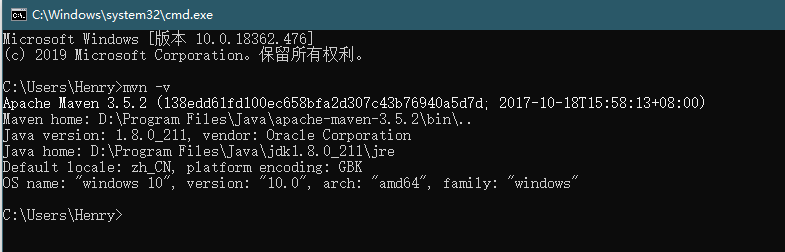


项目仓库文件和配置文件可以放在其他位置，可以配置镜像和代理，加速下载。

settings.xml

```java
  <mirrors>

​	<mirror>
​	　　<id>alimaven</id>
​	　　<mirrorOf>central</mirrorOf>
​	　　<name>aliyun maven</name>
​	　　<url>http://maven.aliyun.com/nexus/content/groups/public/</url>
​	</mirror>
​	
​	
  </mirrors>


```

我这里放到了C盘，以后可能会占用很多空间，可以移植到其他地方

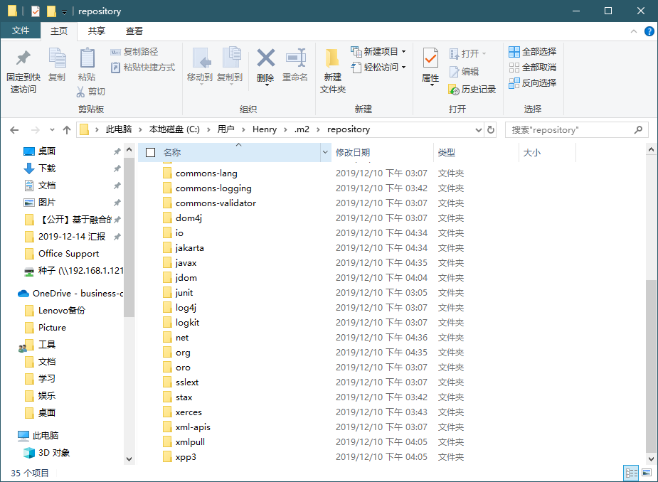


IDEA中，对于文件夹的要求非常高，必须文件夹的类型正确才能创建出文件

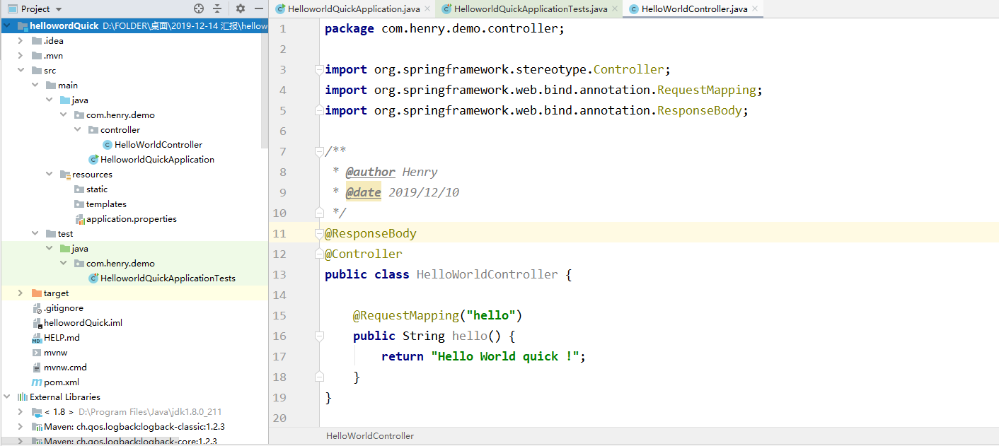

右侧的Lifestyle可以控制Maven的包下载管理，比较方便，在移植别人的代码时，有可能已经有了target文件夹，可以clean后再生成自己的，有可能因为这个导致编译不成功。


运行成功后的结果图：

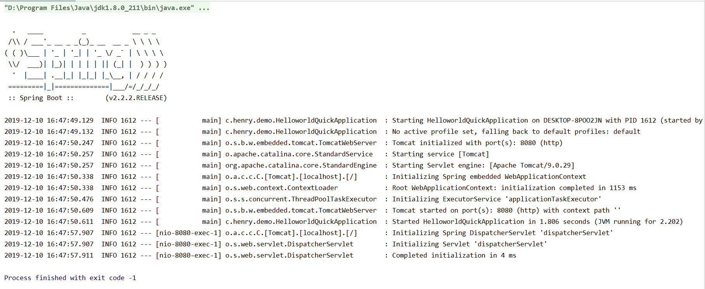

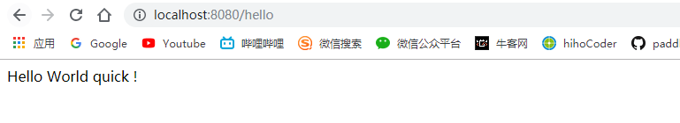


注：Intellij IDEA上新建项目或模块没有Spring Initializr选项解决办法

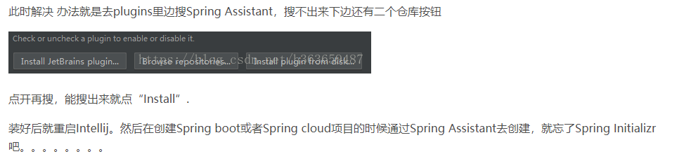

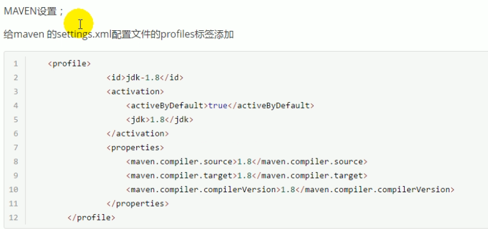

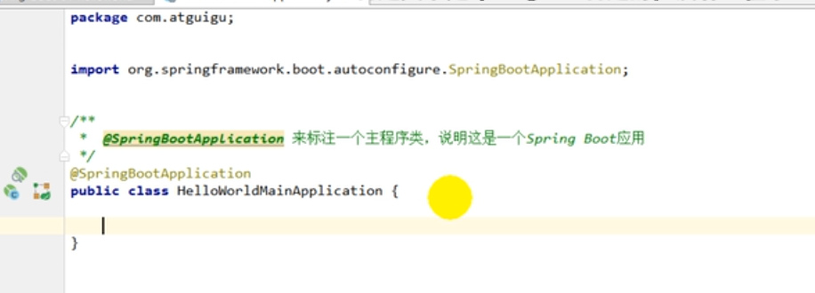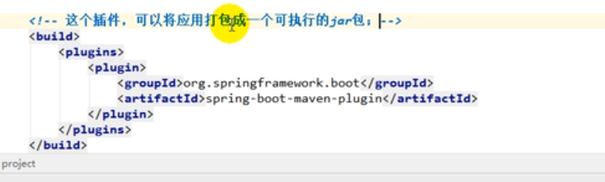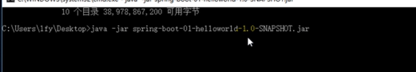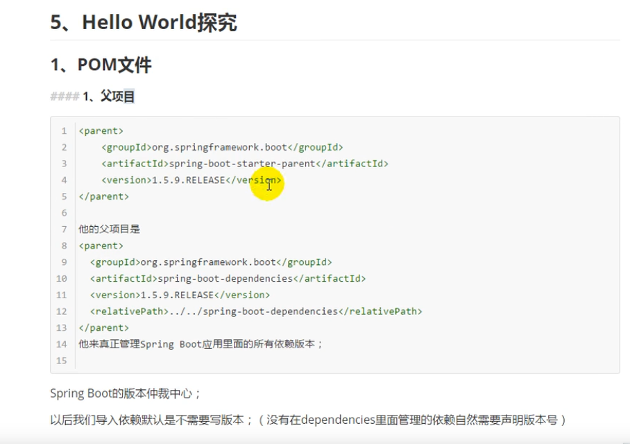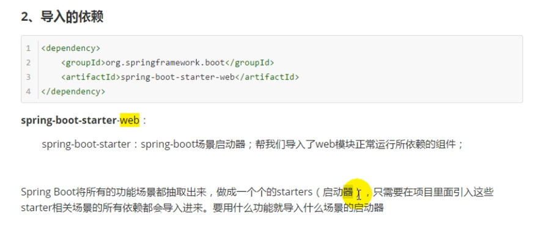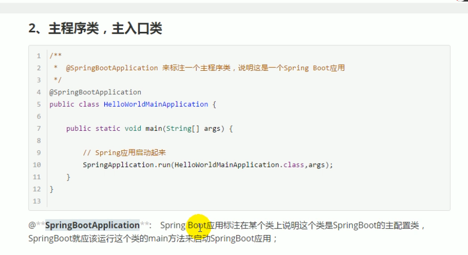


https://www.bilibili.com/video/av38657363?p=7